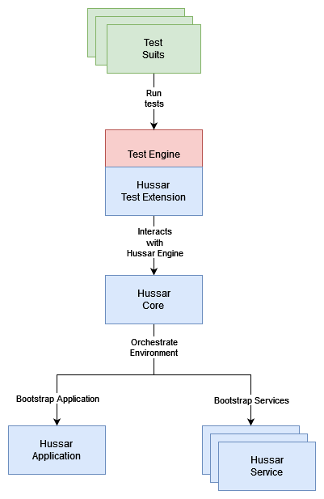

### Hussar

---

**Hussar** is a **highly extensible integration testing framework** engineered to provide robust and flexible testing capabilities. It is designed to seamlessly integrate with a wide range of testing environments, offering the following key features:

- **Framework-Agnostic Integration:**  
  Hussar is built to be independent of any specific testing framework, enabling effortless integration with existing and new testing infrastructures. This flexibility makes it an ideal choice for teams working with diverse or evolving toolchains.

- **Minimal Dependency Footprint:**  
  The framework is designed with simplicity in mind, requiring only a minimal set of dependencies. This ensures that it can be easily incorporated into complex projects without introducing unnecessary overhead or conflicts.

- **JDK 21 Foundation:**  
  Hussar is developed using JDK 21, leveraging the latest advancements in the Java platform. This ensures compatibility with modern Java features and optimizations, providing a solid foundation for high-performance testing.

- **Automated and Efficient Test Setup:**  
  The framework includes built-in mechanisms for automatic and rapid test environment setup. This reduces the manual effort required for test preparation and minimizes setup time, allowing developers to focus on writing and executing tests.

- **Comprehensive Out-of-the-Box Features:**  
  Hussar comes with a wide array of pre-built features that support various testing scenarios, significantly accelerating the testing process. These features cover common testing needs, enabling teams to achieve more with less custom code.

- **Active Development and Maintenance:**  
  The framework is actively developed, with continuous updates and improvements being made. This ensures that Hussar remains up-to-date with the latest testing practices and integrates well with emerging technologies and methodologies.

Overall, **Hussar** provides a powerful, flexible, and efficient solution for integration testing, making it a valuable tool for teams seeking to enhance their testing workflows.


### Table of Contents

---

- [Vocabulary](#vocabulary)
- [Architecture](#architecture)
- [Components](#components)
  - [Core](#core-component)
  - [Applications](#applications-component)
    - [Module application](#module-application-component)
    - [Spring Boot application](#spring-boot-application-component)
  - [Extensions](#extensions-component)
    - [JUnit5 extension](#junit5-extension-component)
  - [Services](#services-component)
    - [Service Core](#core-service-component) 
    - [WireMock](#wiremock-service-component)
    - [MySQL](#mysql-service-component)
    - [MariaDB](#mariadb-service-component)
    - [PostgreSQL](#postgresql-service-component)
    - [MongoDB](#mongodb-service-component)
    - [Redis](#redis-service-component)
    - [RabbitMQ](#rabbitmq-service-component)
    - [Kafka](#kafka-service-component)
    - [Custom](#custom-service-component)
- [Examples](#examples)
  - [JUnit5 & Spring Boot](#junit5-springboot-basic-example)
  - [JUnit5 & Spring Boot - advanced](#junit5-springboot-advanced-example)
  - [JUnit5 & Module Application](#junit5-module-example)
  - [Dynamic binding of application configurations - environment variables](#dynamic-binding-app-config-environment-variable-example)
  - [Dynamic binding of application configurations - properties](#dynamic-binding-app-config-properties-example)
  - [Reference Hussar Application](#reference-hussar-application-example)
  - [Reference Hussar Service](#reference-hussar-service-example)
  - [Share environment between multiple tests](#share-multiple-environments-example)
  - [Multiple Environments](#multiple-test-environments-example)
  - [Restarting application [TO BE RELEASED in 1.5]](#restarting-application-example)
  - [WireMock configuration](#wiremock-configuration-example)
  - [MySQL configuration](#mysql-configuration-example)
  - [MariaDB configuration](#mariadb-configuration-example)
  - [PostgreSQL configuration](#postgresql-configuration-example)
  - [MongoDB configuration](#mongodb-configuration-example)
  - [Redis configuration](#redis-configuration-example)
  - [RabbitMQ configuration](#rabbitmq-configuration-example)
  - [Kafka configuration](#kafka-configuration-example)
  - [Setting custom Docker Registry](#setting-custom-docker-registry-example)
- [Contributors](#contributors)

<a id="vocabulary"></a>
### Vocabulary

---

This section presents the **key terminologies and concepts** that are fundamental for understanding and using the Hussar testing framework.

> **Hussar Application**
> 
> The term **application under test (AUT)** refers to the specific software system or module being evaluated within a testing environment. In other words, that could be your Spring Boot application, etc.
>
> **[See supported applications](#applications).**
---
> **Hussar Extension**
>
> The term **testing framework extension** refers to an augmentation or enhancement of a core testing framework. It glues the testing framework and Hussar together. For example, a JUnit5 extension.
> 
> **[See supported extensions](#extensions).**
---
> **Hussar Service**
>
> In many cases, the **application under test (AUT)** requires integration with external services or components to simulate real-world operational environments. These services may include mock servers, databases, or third-party APIs, which are essential for validating the application's behavior under various conditions. For instance, **WireMock** can be used to simulate HTTP-based services, allowing controlled testing of external dependencies, while a **MySQL** database may serve as the backend persistence layer. Proper integration with these services ensures that the testing environment accurately reflects production scenarios, allowing for comprehensive validation of the application's functionality and robustness.
>
> **[See supported services](#services).**
---
> **Hussar Environment**
>
> To execute the test suites, a single critical component must be configured—**Hussar Environment**. This environment encapsulates the necessary infrastructure and configurations required to run the tests effectively. It consists of the following key elements:
> 
> - **Hussar Application**
> - **Hussar Services**
> - **Hussar Configurations** (e.g., properties, environment variables)
> 
> Proper configuration of these features ensures a cohesive and fully operational testing environment, essential for executing comprehensive test suites.

<a id="architecture"></a>
### Architecture

---

This section provides a comprehensive overview of the **Hussar architecture**, presenting high-level insights into its structural design and component interactions. It outlines the key architectural elements, their interdependencies, and the overall system topology. This foundational information is critical for understanding how the Hussar system operates, enabling deeper exploration into specific components, data flows, and integration points throughout the platform.



To get more information about specific components check the following sections:
- [Vocabulary](#vocabulary)
- [Components](#components)

<a id="components"></a>
### Components
<hr class="separator">

This section offers a concise overview of the individual **Hussar components**, detailing their roles and responsibilities within the overall system architecture. Each component is described in terms of its core functionality, interconnectivity with other system modules, and its contribution to the operation and performance of the Hussar platform. This high-level summary provides essential context for understanding how these components collaboratively support the platform's objectives.

> **Core** <a id="core-component"/>
>
> The most **critical component** of the Hussar platform. It functions as the **orchestration layer**, responsible for managing the Hussar's **lifecycle**, including setup and teardown processes.
>
> Below are the instructions for integrating this artifact into your Gradle or Maven projects:
>```
>Gradle
>implementation pl.netroute:hussar-core:${version}
>```
>
>```
>Maven
><dependency>
>   <groupId>pl.netroute</groupId>
>   <artifactId>hussar-core</artifactId>
>   version>${version}</version>
><dependency>
>```

<a id="applications-component"></a>
#### Applications

---

This section provides an overview of all **supported Hussar applications** that are available out of the box. These pre-configured applications are designed to integrate seamlessly into the Hussar ecosystem, offering standardized functionality.

> **Module application** <a id="module-application-component"/>
>
> This component serves as the **integration layer** that seamlessly binds the **Hussar platform** with framework less applications (like Spring web etc.). So if you have hexagonal architecture and want to test modules(adapters) then it's for you.
>
> Below are the instructions for integrating this artifact into your Gradle or Maven projects:
>```
>Gradle
>implementation pl.netroute:hussar-core:${version}
>```
>
>```
>Maven
><dependency>
>   <groupId>pl.netroute</groupId>
>   <artifactId>hussar-core</artifactId>
>   version>${version}</version>
><dependency>
>```

> **Spring Boot application** <a id="spring-boot-application-component"/>
>
> This component serves as the **integration layer** that seamlessly binds the **Hussar platform** with **Spring Boot** applications. It provides native support for Spring Boot. If your system is built on the Spring Boot framework, this component is specifically designed to facilitate efficient and streamlined integration with Hussar's ecosystem.
>
> Below are the instructions for integrating this artifact into your Gradle or Maven projects:
>```
>Gradle
>implementation pl.netroute:hussar-spring-boot-application:${version}
>```
>
>```
>Maven
><dependency>
>   <groupId>pl.netroute</groupId>
>   <artifactId>hussar-spring-boot-application</artifactId>
>   version>${version}</version>
><dependency>
>```

<a id="extensions-component"></a>
#### Extensions

---

This section provides an overview of all **supported Hussar test engine extensions** that are available out of the box. These extensions are designed to enhance the functionality of the core Hussar test engine, offering additional capabilities such as custom lifecycle management, specialized test execution strategies, and advanced integration features.

> **JUnit5 extension** <a id="junit5-extension-component"/>
>
> This component functions as the **bridge between the Hussar platform and JUnit 5**, ensuring seamless integration and compatibility. It is specifically designed to enhance the execution of tests within the **JUnit 5** framework, leveraging Hussar's advanced testing features while maintaining adherence to JUnit 5's structure and conventions. If your testing environment is based on JUnit 5, this component is tailored to optimize test orchestration, providing a cohesive and efficient testing experience within the Hussar ecosystem.
>
> Below are the instructions for integrating this artifact into your Gradle or Maven projects:
>```
>Gradle
>implementation pl.netroute:hussar-junit5-extension:${version}
>```
>
>```
>Maven
><dependency>
>   <groupId>pl.netroute</groupId>
>   <artifactId>hussar-junit5-extension</artifactId>
>   version>${version}</version>
><dependency>
>```

<a id="services-component"></a>
#### Services

---

This section provides a detailed overview of all **supported Hussar services** that are available out of the box. These services are pre-configured to integrate seamlessly with the Hussar platform.

> **Service Core** <a id="core-service-component"/>
>
> This component contains all the core features of Hussar Services. If you need to use any Hussar Service (highly probable) then this component has to be added as a dependency.
>
> Below are the instructions for integrating this artifact into your Gradle or Maven projects:
>```
>Gradle
>implementation pl.netroute:hussar-service-core:${version}
>```
>
>```
>Maven
><dependency>
>   <groupId>pl.netroute</groupId>
>   <artifactId>hussar-service-core</artifactId>
>   version>${version}</version>
><dependency>
>```
---
> **WireMock** <a id="wiremock-service-component"/>
>  
> WireMock is a robust and flexible tool for mocking HTTP-based APIs, primarily used in testing scenarios. It allows developers to simulate HTTP services and create realistic test environments without relying on actual external systems.
> By mimicking the behavior of web services, WireMock enables the development and testing of applications in isolation.
> 
> The Hussar's WireMock service is docker based. The image used under the hood is [**wiremock/wiremock**](https://hub.docker.com/r/wiremock/wiremock).
> 
> The table below shows the most important methods that you can use to configure **WireMock**:
> 
>| Method                                   	    | Description                                                                    	              | Default                 	 |
>|-----------------------------------------------|-----------------------------------------------------------------------------------------------|---------------------------|
>| `name`                                     	  | Sets the name of Hussar WireMock service.                                      	              | Uniquely generated one. 	 |
>| `dockerImageVersion`                       	  | Sets the docker image version of WireMock.                                     	              | Latest.                 	 |
>| `dockerRegistryUrl`                           | Sets custom docker registry URL.                                                              | Docker Hub.               |
>| `registerEndpointUnderProperty`            	  | Dynamically registers WireMock's endpoint under given property(ies).           	              | Empty Set.              	 |
>| `registerEndpointUnderEnvironmentVariable` 	  | Dynamically registers WireMock's endpoint under given environment variable(s). 	              | Empty Set.              	 |
>| `done`                                     	  | Finishes configuring WireMock's configurer.                                                 	 | N/A                     	 |
> If you want to see a proper example, you can find it under [WireMock configuration](#wiremock-configuration-example) section.
---
> **MySQL** <a id="mysql-service-component"/>
> 
> MySQL is a popular and widely-used, open-source relational database management system (RDBMS). MySQL offers enhanced performance, reliability, scalability, and features, making it a strong choice for developers building modern applications.
> 
> The Hussar's MySQL service is docker based. The image used under the hood is [**mysql**](https://hub.docker.com/_/mysql).
> 
> The table below shows the most important methods that you can use to configure **MySQL**:
> 
>| Method                                   	   | Description                                                                    	           | Default                 	 |
>|----------------------------------------------|--------------------------------------------------------------------------------------------|---------------------------|
>| `name`                                     	 | Sets the name of Hussar MySQL service.                                      	              | Uniquely generated one. 	 |
>| `dockerImageVersion`                       	 | Sets the docker image version of MySQL.                                     	              | Latest.                 	 |
>| `dockerRegistryUrl`                          | Sets custom docker registry URL.                                                           | Docker Hub.               |
>| `registerEndpointUnderProperty`            	 | Dynamically registers MySQL's endpoint under given property(ies).           	              | Empty Set.              	 |
>| `registerEndpointUnderEnvironmentVariable` 	 | Dynamically registers MySQL's endpoint under given environment variable(s). 	              | Empty Set.              	 |
>| `registerUsernameUnderProperty`              | Dynamically registers MySQL's username under given property(ies).                          | Empty Set.                |
>| `registerUsernameUnderEnvironmentVariables`  | Dynamically registers MySQL's username under given environment variable(s).                | Empty Set.                |
>| `registerPasswordUnderProperties`            | Dynamically registers MySQL's password under given property(ies).                          | Empty Set.                |
>| `registerPasswordUnderEnvironmentVariables`  | Dynamically registers MySQL's password under given environment variable(s).                | Empty Set.                |
>| `databaseSchemas`                            | Creates schema(s).                                                                         | Empty Set.                |
>| `done`                                     	 | Finishes configuring MySQL's configurer.                                                 	 | N/A                     	 |
> 
> If you want to see a proper example, you can find it under [MySQL configuration](#mysql-configuration-example) section.
---
> **MariaDB** <a id="mariadb-service-component"/>
>
> MariaDB is a popular and widely-used, open-source relational database management system (RDBMS). MariaDB offers enhanced performance, reliability, scalability, and features, making it a strong choice for developers building modern applications.
> 
> The Hussar's MariaDB service is docker based. The image used under the hood is [**mariadb**](https://hub.docker.com/_/mariadb).
>
> The table below shows the most important methods that you can use to configure **MariaDB**:
>
>| Method                                   	   | Description                                                                    	             | Default                 	 |
>|----------------------------------------------|----------------------------------------------------------------------------------------------|---------------------------|
>| `name`                                     	 | Sets the name of Hussar MariaDB service.                                      	              | Uniquely generated one. 	 |
>| `dockerImageVersion`                       	 | Sets the docker image version of MariaDB.                                     	              | Latest.                 	 |
>| `dockerRegistryUrl`                          | Sets custom docker registry URL.                                                             | Docker Hub.               |
>| `registerEndpointUnderProperty`            	 | Dynamically registers MariaDB's endpoint under given property(ies).           	              | Empty Set.              	 |
>| `registerEndpointUnderEnvironmentVariable` 	 | Dynamically registers MariaDB's endpoint under given environment variable(s). 	              | Empty Set.              	 |
>| `registerUsernameUnderProperty`              | Dynamically registers MariaDB's username under given property(ies).                          | Empty Set.                |
>| `registerUsernameUnderEnvironmentVariables`  | Dynamically registers MariaDB's username under given environment variable(s).                | Empty Set.                |
>| `registerPasswordUnderProperties`            | Dynamically registers MariaDB's password under given property(ies).                          | Empty Set.                |
>| `registerPasswordUnderEnvironmentVariables`  | Dynamically registers MariaDB's password under given environment variable(s).                | Empty Set.                |
>| `databaseSchemas`                            | Creates schema(s).                                                                           | Empty Set.                |
>| `done`                                     	 | Finishes configuring MariaDB's configurer.                                                 	 | N/A                     	 |
>
> If you want to see a proper example, you can find it under [MariaDB configuration](#mariadb-configuration-example) section.
---
> **PostgreSQL** <a id="postgresql-service-component"/>
>
> PostgreSQL is a popular and widely-used, open-source relational database management system (RDBMS). PostgreSQL offers enhanced performance, reliability, scalability, and features, making it a strong choice for developers building modern applications.
>
> The Hussar's PostgreSQL service is docker based. The image used under the hood is [**postgres**](https://hub.docker.com/_/postgres).
>
> The table below shows the most important methods that you can use to configure **PostgreSQL**:
>
>| Method                                   	   | Description                                                                    	                | Default                 	 |
>|----------------------------------------------|-------------------------------------------------------------------------------------------------|---------------------------|
>| `name`                                     	 | Sets the name of Hussar PostgreSQL service.                                      	              | Uniquely generated one. 	 |
>| `dockerImageVersion`                       	 | Sets the docker image version of PostgreSQL.                                     	              | Latest.                 	 |
>| `dockerRegistryUrl`                          | Sets custom docker registry URL.                                                                | Docker Hub.               |
>| `registerEndpointUnderProperty`            	 | Dynamically registers PostgreSQL's endpoint under given property(ies).           	              | Empty Set.              	 |
>| `registerEndpointUnderEnvironmentVariable` 	 | Dynamically registers PostgreSQL's endpoint under given environment variable(s). 	              | Empty Set.              	 |
>| `registerUsernameUnderProperty`              | Dynamically registers PostgreSQL's username under given property(ies).                          | Empty Set.                |
>| `registerUsernameUnderEnvironmentVariables`  | Dynamically registers PostgreSQL's username under given environment variable(s).                | Empty Set.                |
>| `registerPasswordUnderProperties`            | Dynamically registers PostgreSQL's password under given property(ies).                          | Empty Set.                |
>| `registerPasswordUnderEnvironmentVariables`  | Dynamically registers PostgreSQL's password under given environment variable(s).                | Empty Set.                |
>| `databaseSchemas`                            | Creates schema(s).                                                                              | Empty Set.                |
>| `done`                                     	 | Finishes configuring PostgreSQL's configurer.                                                 	 | N/A                     	 |
>
> If you want to see a proper example, you can find it under [PostgreSQL configuration](#postgresql-configuration-example) section.
---
> **MongoDB** <a id="mongodb-service-component"/>
>
> MongoDB is a NoSQL database designed for scalability, flexibility, and performance. It uses a document-oriented data model, allowing developers to store and retrieve data in JSON-like BSON (Binary JSON) format, making it a popular choice for modern applications.
>
> The Hussar's MongoDB service is docker based. The image used under the hood is [**mongo**](https://hub.docker.com/_/mongo).
>
> The table below shows the most important methods that you can use to configure **MongoDB**:
>
>| Method                                   	   | Description                                                                    	            | Default                 	 |
>|----------------------------------------------|---------------------------------------------------------------------------------------------|---------------------------|
>| `name`                                     	 | Sets the name of Hussar MongoDB service.                                      	             | Uniquely generated one. 	 |
>| `dockerImageVersion`                       	 | Sets the docker image version of MongoDB.                                     	             | Latest.                 	 |
>| `dockerRegistryUrl`                          | Sets custom docker registry URL.                                                            | Docker Hub.               |
>| `registerEndpointUnderProperty`            	 | Dynamically registers MongoDB's endpoint under given property(ies).           	             | Empty Set.              	 |
>| `registerEndpointUnderEnvironmentVariable` 	 | Dynamically registers MongoDB's endpoint under given environment variable(s). 	             | Empty Set.              	 |
>| `registerUsernameUnderProperty`              | Dynamically registers MongoDB's username under given property(ies).                         | Empty Set.                |
>| `registerUsernameUnderEnvironmentVariables`  | Dynamically registers MongoDB's username under given environment variable(s).               | Empty Set.                |
>| `registerPasswordUnderProperties`            | Dynamically registers MongoDB's password under given property(ies).                         | Empty Set.                |
>| `registerPasswordUnderEnvironmentVariables`  | Dynamically registers MongoDB's password under given environment variable(s).               | Empty Set.                |
>| `done`                                     	 | Finishes configuring MongoDB's configurer.                                                 	 | N/A                     	 |
>
> If you want to see a proper example, you can find it under [MongoDB configuration](#mongodb-configuration-example) section.
---
> **Redis** <a id="redis-service-component"/>
>
> Redis is an in-memory data structure store used as a database, cache, and message broker. Known for its high performance and versatility, Redis supports various data structures such as strings, hashes, lists, sets, and more, making it a popular choice for real-time applications.
>
> The Hussar's Redis service is docker based. The image used under the hood is [**redis**](https://hub.docker.com/_/redis).
>
> The table below shows the most important methods that you can use to configure **Redis**:
>
>| Method                                   	   | Description                                                                    	           | Default                 	 |
>|----------------------------------------------|--------------------------------------------------------------------------------------------|---------------------------|
>| `name`                                     	 | Sets the name of Hussar Redis service.                                      	              | Uniquely generated one. 	 |
>| `dockerImageVersion`                       	 | Sets the docker image version of Redis.                                     	              | Latest.                 	 |
>| `dockerRegistryUrl`                          | Sets custom docker registry URL.                                                           | Docker Hub.               |
>| `registerEndpointUnderProperty`            	 | Dynamically registers Redis's endpoint under given property(ies).           	              | Empty Set.              	 |
>| `registerEndpointUnderEnvironmentVariable` 	 | Dynamically registers Redis's endpoint under given environment variable(s). 	              | Empty Set.              	 |
>| `registerUsernameUnderProperty`              | Dynamically registers Redis's username under given property(ies).                          | Empty Set.                |
>| `registerUsernameUnderEnvironmentVariables`  | Dynamically registers Redis's username under given environment variable(s).                | Empty Set.                |
>| `registerPasswordUnderProperties`            | Dynamically registers Redis's password under given property(ies).                          | Empty Set.                |
>| `registerPasswordUnderEnvironmentVariables`  | Dynamically registers Redis's password under given environment variable(s).                | Empty Set.                |
>| `enablePassword`                             | Enable/Disable password.                                                                   | False.                    |
>| `done`                                     	 | Finishes configuring Redis's configurer.                                                 	 | N/A                     	 |
>
> If you want to see a proper example, you can find it under [Redis configuration](#redis-configuration-example) section.
---
> **RabbitMQ** <a id="rabbitmq-service-component"/>
>
> RabbitMQ is a robust message broker that facilitates communication between distributed systems by implementing the Advanced Message Queuing Protocol (AMQP). It is designed for reliability, scalability, and flexibility, making it an essential tool for building scalable and resilient applications.
>
> The Hussar's RabbitMQ service is docker based. The image used under the hood is [**rabbitmq**](https://hub.docker.com/_/rabbitmq).
>
> The table below shows the most important methods that you can use to configure **RabbitMQ**:
>
>| Method                                   	   | Description                                                                    	              | Default                 	 |
>|----------------------------------------------|-----------------------------------------------------------------------------------------------|---------------------------|
>| `name`                                     	 | Sets the name of Hussar RabbitMQ service.                                      	              | Uniquely generated one. 	 |
>| `dockerImageVersion`                       	 | Sets the docker image version of RabbitMQ.                                     	              | Latest.                 	 |
>| `dockerRegistryUrl`                          | Sets custom docker registry URL.                                                              | Docker Hub.               |
>| `registerEndpointUnderProperty`            	 | Dynamically registers RabbitMQ's endpoint under given property(ies).           	              | Empty Set.              	 |
>| `registerEndpointUnderEnvironmentVariable` 	 | Dynamically registers RabbitMQ's endpoint under given environment variable(s). 	              | Empty Set.              	 |
>| `registerUsernameUnderProperty`              | Dynamically registers RabbitMQ's username under given property(ies).                          | Empty Set.                |
>| `registerUsernameUnderEnvironmentVariables`  | Dynamically registers RabbitMQ's username under given environment variable(s).                | Empty Set.                |
>| `registerPasswordUnderProperties`            | Dynamically registers RabbitMQ's password under given property(ies).                          | Empty Set.                |
>| `registerPasswordUnderEnvironmentVariables`  | Dynamically registers RabbitMQ's password under given environment variable(s).                | Empty Set.                |
>| `queue`                                      | Creates queue(s).                                                                             | Empty Set.                |
>| `done`                                     	 | Finishes configuring RabbitMQ's configurer.                                                 	 | N/A                     	 |
>
> If you want to see a proper example, you can find it under [RabbitMQ configuration](#rabbitmq-configuration-example) section.
---
> **Kafka** <a id="kafka-service-component"/>
>
> Kafka is a distributed streaming platform developed by Apache, designed for building real-time data pipelines and streaming applications. It is renowned for its scalability, fault tolerance, and high throughput, making it a popular choice for handling large volumes of real-time data.
>
> The Hussar's Kafka service is docker based. The image used under the hood is [**confluentinc/cp-kafka**](https://hub.docker.com/r/confluentinc/cp-kafka).
>
> The table below shows the most important methods that you can use to configure **Kafka**:
>
>| Method                                   	   | Description                                                                    	           | Default                 	 |
>|----------------------------------------------|--------------------------------------------------------------------------------------------|---------------------------|
>| `name`                                     	 | Sets the name of Hussar Kafka service.                                      	              | Uniquely generated one. 	 |
>| `dockerImageVersion`                       	 | Sets the docker image version of Kafka.                                     	              | Latest.                 	 |
>| `dockerRegistryUrl`                          | Sets custom docker registry URL.                                                           | Docker Hub.               |
>| `registerEndpointUnderProperty`            	 | Dynamically registers Kafka's endpoint under given property(ies).           	              | Empty Set.              	 |
>| `registerEndpointUnderEnvironmentVariable` 	 | Dynamically registers Kafka's endpoint under given environment variable(s). 	              | Empty Set.              	 |
>| `topic`                                      | Creates topic(s).                                                                          | Empty Set.                |
>| `topicAutoCreation`                          | Enables/Disables auto topic creation.                                                      | False.                    |
>| `kraftMode`                                  | Enables/Disables Kafka kraft mode.                                                         | False.                    |
>| `done`                                     	 | Finishes configuring Kafka's configurer.                                                 	 | N/A                     	 |
>
>If you want to see a proper example, you can find it under [Kafka configuration](#kafka-configuration-example) section.
---
> **Custom** <a id="custom-service-component"/>
>
> Can't you find a Hussar service that suits your needs? Don't worry, there are a couple of solutions:
> - let us know about that. We want to support a huge variety of Hussar services being available out of the box.
> - you can always try to implement your own Hussar service.
>
> The next part of this section focuses on implementing your own Hussar service - perhaps you have some internal tool that you want to keep internal.
> To create your own Hussar service you need to implement **Service** interface - you are free to do it anyway you want to. 
> However, the recommended way is to try to re-use Hussar's infrastructure as much as possible.
> In order to follow Hussar's best practices you should implement the following classes:
> - **Service** - this is the core of the Hussar service.
> - **ServiceConfig** - this is the config of the Hussar service that will be used by the service itself to set it up.
> - **ServiceConfigurer** - this is the configurer which main responsibility is to create Hussar service.
>
> Then depending on the type of component you could extend the following classes:
> - non docker based:
>   - `BaseService`.
>   - `BaseServiceConfig`.
>   - `BaseDockerServiceConfigurer`.
> - docker based:
>   - `BaseDockerService`.
>   - `BaseDockerServiceConfig`.
>   - `BaseDockerServiceConfigurer`.
>
> For more information take a look at currently implemented Hussar services.

<a id="examples"></a>
### Examples

---

This section provides a comprehensive collection of **examples** demonstrating the application of various **Hussar components** to expedite the configuration of your testing environment. Each example is designed to illustrate best practices and effective strategies for integrating Hussar components into your testing workflow. By leveraging these examples, you can quickly establish a robust and functional testing environment, optimizing setup time and ensuring adherence to standardized testing protocols. Detailed usage scenarios and configuration snippets are provided to facilitate seamless implementation and integration.

> **JUnit5 & Spring Boot** <a id="junit5-springboot-basic-example"/>
>
> Let's say that you want to use Hussar to test your Spring Boot application using JUnit5 testing framework. You will need the following Hussar components:
> - pl.netroute:hussar-core
> - pl.netroute:hussar-spring-boot-application
> - pl.netroute:hussar-junit5-extension
>
> This is the Spring Boot application that we want to test:
>
>```java@SpringBootApplication
>public class SimpleSpringApplication {
>
>    public static void main(String[] args) {
>        SpringApplication.run(SimpleSpringApplication.class, args);
>    }
>
>    @RestController
>    @RequestMapping("/api/v1")
>    public static class DefaultController {
>
>        @GetMapping("/ping")
>        public ResponseEntity<String> ping() {
>            return ResponseEntity.ok("pong");
>        }
>
>    }
>}
>```
>
> The next step is to create a JUnit5 test class: 
>
>```java
>@ExtendWith(HussarJUnit5Extension.class) // it glues Hussar and JUnit5 together. It's basically everything you need to make them work together
>@HussarEnvironment(configurerProvider = TestEnvironmentConfigurerProvider.class) // it provides Hussar tests environment configuration
>public class HussarJUnit5IT {
>    
>    @HussarApplication // it injects the Hussar's application
>    private Application application;
>
>    // you can use application's object method to get the physical endpoint - i.e. EndpointHelper.getAnyEndpointOrFail(application)
>
>    // test methods
>    
>}
>```
>
> See [Reference Hussar Application](#reference-hussar-application-example) section for more details about referencing Hussar's application in test classes. 
>
> It's time to go to the next critical component - **TestEnvironmentConfigurerProvider**:
>
>```java
>public class TestEnvironmentConfigurerProvider implements EnvironmentConfigurerProvider { // to provide Hussar's tests environment configuration, you need to implement this interface
>  
>    @Override
>    public LocalEnvironmentConfigurer provide() { // to provide Hussar's tests environment, you need to implement this method and provide the setup you wish to have
>        var application = SpringApplication.newApplication(SimpleSpringApplication.class); // in our example, we want to test SpringBoot application
>
>        return LocalEnvironmentConfigurer
>                .newInstance()
>                .withApplication(application) // it adds the SpringBoot application to the environment configuration
>                .done();
>    }
>
>}
>```
>
> This is all you need to configure to have **Hussar / Junit5 / Spring Boot** combination.
---
> **JUnit5 & Spring Boot - advanced** <a id="junit5-springboot-advanced-example"/>
>
> Let's say that you want to use Hussar to test your Spring Boot application using JUnit5 testing framework. For the purpose of this example let's assume that our application needs to integrate with MongoDB and 3rd party payment service via HTTP API. You will need the following Hussar components:
> - pl.netroute:hussar-core
> - pl.netroute:hussar-spring-boot-application
> - pl.netroute:hussar-core-service
> - pl.netroute:hussar-mongodb-service
> - pl.netroute:hussar-wiremock-service
> - pl.netroute:hussar-junit5-extension
>
> This is the Spring Boot application that we want to test:
>
>```java@SpringBootApplication
>public class PaymentSpringApplication {
>
>    public static void main(String[] args) {
>        SpringApplication.run(PaymentSpringApplication.class, args);
>    }
>
>    @RestController
>    @RequestMapping("/api/payment/v1")
>    public static class PaymentController {
>         
>        @PostMapping("/payment")
>        public ResponseEntity<PaymentResponse> initiatePayment(PaymentRequest request) {
>            // Payment initiation - making a call to 3rd party payment service and storing the result in MongoDB
>        }
>
>    }
>}
>```
>
> Our Spring Boot application has the following configuration file (application.yml):
>
>```
>spring.application.name: payment-service
>
>application.mongodb.url: ${MONGODB_URL} // expect MONGODB_URL to be set to actual URL of MongoDB service
>application.mongodb.username: ${MONGODB_USERNAME} // expect MONGODB_USERNAME to be set to actual username of MongoDB service
>application.mongodb.password: ${MONGODB_PASSWORD} // expect MONGODB_PASSWORD to be set to actual password of MongoDB service
>
>application.client.payment.url: https://local.dev // set to a hardcoded value
>```
>
> The next step is to create a JUnit5 test class:
>
>```java
>@ExtendWith(HussarJUnit5Extension.class) // it glues Hussar and JUnit5 together. It's basically everything you need to make them work together
>@HussarEnvironment(configurerProvider = TestEnvironmentConfigurerProvider.class) // it provides Hussar tests environment configuration
>public class PaymentIT {
>
>    @HussarApplication // it injects the Hussar's application
>    private Application application;
>
>    @HussarService // it injects the Hussar's WireMock service
>    private WiremockDockerService wireMock;
>
>    @HussarService // it injects the Hussar's MongoDB service
>    private MongoDBDockerService mongoDB;
>
>    // you can use application's object method to get the physical endpoint - i.e. EndpointHelper.getAnyEndpointOrFail(application)
>    // you can use WireMock's object method to get the physical endpoint - i.e. EndpointHelper.getAnyEndpointOrFail(wireMock)
>    // you can use MongoDB's object method to get the physical endpoint - i.e. EndpointHelper.getAnyEndpointOrFail(mongoDB)
>  
>    // test methods
>    
>}
>```
>
> See [Reference Hussar Application](#reference-hussar-application-example) section for more details about referencing Hussar's application in test classes.
>
> See [Reference Hussar Service](#reference-hussar-service-example) section for more details about referencing Hussar's services in test classes.
>
> It's time to go to the next critical component - **TestEnvironmentConfigurerProvider**:
>
>```java
>public class TestEnvironmentConfigurerProvider implements EnvironmentConfigurerProvider { // to provide Hussar's tests environment configuration, you need to implement this interface
>
>  @Override
>  public LocalEnvironmentConfigurer provide() { // to provide Hussar's tests environment, you need to implement this method and provide the setup you wish to have
>      var application = SpringApplication.newApplication(PaymentSpringApplication .class); // in our example, we want to test SpringBoot application
>
>      var wiremockService = WiremockDockerServiceConfigurer
>            .newInstance()
>            .registerEndpointUnderProperty("application.client.payment.url") // the given property will be overridden with actual URL of WireMock service 
>            .done()
>            .configure();
>
>      var mongoDBService = MongoDBDockerServiceConfigurer
>            .newInstance()
>            .dockerImageVersion(dockerVersion) // it overrides the actual docker image version
>            .registerEndpointUnderEnvironmentVariable("MONGODB_URL") // the given environment variable will be overridden with actual URL of MongoDB service
>            .registerUsernameUnderEnvironmentVariable("MONGODB_USERNAME") // the given environment variable will be overridden with actual username of MongoDB service
>            .registerPasswordUnderEnvironmentVariable("MONGODB_PASSWORD") // the given environment variable will be overridden with actual password of MongoDB service
>            .done()
>            .configure();
>    
>      return LocalEnvironmentConfigurer
>            .newInstance()
>            .withApplication(application) // it adds the SpringBoot application to the environment configuration
>            .withService(wiremockService) // it adds WireMock service to the environment configuration
>            .withService(mongoDBService) // it adds MongoDB service to the environment configuration
>            .done();
>  }
>
>}
>```
>
> See [Dynamic binding of application configurations - environment variables](#dynamic-binding-app-config-environment-variable-example) or [Dynamic binding of application configurations - properties](#dynamic-binding-app-config-properties-example) section for more details about dynamic binding of configurations in Hussar.
>
> This is all you need to configure to have **Hussar / Junit5 / Spring Boot** combination.
---
> **JUnit5 & Module Application** <a id="junit5-module-example"/>
>
> Let's say that you want to use Hussar to test your modules (for example parts of Hexagonal architecture) application using JUnit5 testing framework. For the purpose of this example let's assume that our module needs to integrate with MySQL database . You will need the following Hussar components:
> - pl.netroute:hussar-core
> - pl.netroute:hussar-core-service
> - pl.netroute:hussar-sql-service
> - pl.netroute:hussar-junit5-extension
>
> The next step is to create a JUnit5 test class:
>
>```java
>@ExtendWith(HussarJUnit5Extension.class) // it glues Hussar and JUnit5 together. It's basically everything you need to make them work together
>@HussarEnvironment(configurerProvider = TestEnvironmentConfigurerProvider.class) // it provides Hussar tests environment configuration
>public class ModuleDatabaseIT {
>
>    @HussarService // it injects the Hussar's WireMock service
>    private MySQLDockerService mySQL;
>
>    // you can use MySQL's object method to get the physical endpoint - i.e. EndpointHelper.getAnyEndpointOrFail(mySQL)
>  
>    // test methods
>    
>}
>```
>
> See [Reference Hussar Service](#reference-hussar-service-example) section for more details about referencing Hussar's services in test classes.
>
> It's time to go to the next critical component - **TestEnvironmentConfigurerProvider**:
>
>```java
>public class TestEnvironmentConfigurerProvider implements EnvironmentConfigurerProvider { // to provide Hussar's tests environment configuration, you need to implement this interface
>
>  @Override
>  public LocalEnvironmentConfigurer provide() { // to provide Hussar's tests environment, you need to implement this method and provide the setup you wish to have
>      var application = ModuleApplication.newApplication(); // in our example, we want to test our module application
>
>      var databaseSchema = new SQLDatabaseSchema("HussarDB", "/db/migration/scripts"); // it creates a SQL database schema on startup. The schema will use the scripts to initialize everything 
>    
>      var mySQLService = MySQLDockerServiceConfigurer
>            .newInstance()
>            .name("mysql-service") // it sets the name of the service. It's optional parameter.
>            .dockerImageVersion("8.2.0") // it sets the docker image version. It's optional parameter.
>            .databaseSchema(databaseSchema) // it sets the database schema that should be created and initialized. It's optional parameter.
>            .done()
>            .configure();
>    
>      return LocalEnvironmentConfigurer
>            .newInstance()
>            .withApplication(application) // it adds the Module application to the environment configuration
>            .withService(wiremockService) // it adds MySQL service to the environment configuration
>            .done();
>  }
>
>}
>```
>
> This is all you need to configure to have **Hussar / Junit5 / Module** combination.
---
> **Dynamic binding of application configurations - environment variables** <a id="dynamic-binding-app-config-environment-variable-example"/>
>
> This section shows how to use Hussar's dynamic configuration binding by using environment variables. Most of the time your application comes with an application file(s) and ideally you want to re-use them in testing and in production.
> Let's imagine that our application needs to connect to database. That could be our application configuration file:
>
>```
>server.name: husar-test-application
>
>application.mysql.url: ${MYSQL_URL} // expect MYSQL_URL to be set to actual URL of MySQL service
>application.mysql.username: ${MYSQL_USERNAME} // expect MYSQL_USERNAME to be set to actual username of MySQL service
>application.mysql.password: ${MYSQL_PASSWORD} // expect MYSQL_PASSWORD to be set to actual password of MySQL service
>```
>
> Hussar makes it very easy to bind dynamic service's configurations with the application configuration by using environment variables. Let's see how can we use service's dynamic binding:
>
>```java
>MySQLDockerServiceConfigurer
>    .newInstance()
>    .registerEndpointUnderEnvironmentVariable("MYSQL_URL") // the given environment variable will be overridden with actual URL of MYSQL service
>    .registerUsernameUnderEnvironmentVariable("MYSQL_USERNAME") // the given environment variable will be overridden with actual username of MySQL service
>    .registerPasswordUnderEnvironmentVariable("MYSQL_PASSWORD") // the given environment variable will be overridden with actual password of MySQL service
>    .done()
>    .configure();
>```
>
> In the above example, once the Hussar environment is initialized and started then the configurations are going to be bound with the real values of **MySQLDockerService** - URL, username, password respectively.
> It's done automatically by Hussar and what's really important to note is that the original application configuration file(s) is not changed.
> Moreover, it's also worth mentioning that whenever you use environment variable for dynamic binding they are purely **virtual** - visible/set only within Hussar environment. They don't exist outside of Hussar environment.
>
> To visualize how the dynamic binding works, that would be the end result:
>
>```
>server.name: husar-test-application
>
>application.mysql.url: jdbc:mysql://localhost:3306 // the actual URL of MySQL service was set
>application.mysql.username: test_user // the actual username of MySQL service was set
>application.mysql.password: test_password // the actual password of MySQL service was set
>```
>
> It's practically what you need to do in order to dynamically bind your application configuration with Hussar's services.
---
> **Dynamic binding of application configurations - properties** <a id="dynamic-binding-app-config-properties-example"/>
>
> This section shows how to use Hussar's dynamic configuration binding by overriding properties. Most of the time your application comes with an application file(s) and ideally you want to re-use them in testing and in production.
> Let's imagine that our application needs to connect to database. That could be our application configuration file:
>
>```
>server.name: husar-test-application
>
>application.mysql.url: jdbc:mysql://dev.host:3306 // set to a hardcoded URL of MySQL
>application.mysql.username: dev_user // set to a hardcoded username of MySQL
>application.mysql.password: dev_password // set to a hardcoded password of MySQL
>```
>
> Hussar makes it very easy to bind dynamic service's configurations with the application configuration by overriding properties. Let's see how can we use service's dynamic binding:
>
>```java
>MySQLDockerServiceConfigurer
>    .newInstance()
>    .registerEndpointUnderProperty("application.mysql.url") // the given property will be overridden with actual URL of MySQL service
>    .registerUsernameUnderProperty("application.mysql.username") // the given property will be overridden with actual username of MySQL service
>    .registerPasswordUnderProperty("application.mysql.password") // the given property will be overridden with actual password of MySQL service
>    .done()
>    .configure();
>```
>
> In the above example, once the Hussar environment is initialized and started then the configurations are going to be bound with the real values of **MySQLDockerService** - URL, username, password respectively.
> It's done automatically by Hussar and what's really important to note is that the original application configuration file(s) is not changed.
> As you can see Hussar is able to override the property with a dynamic value.
>
> To visualize how the dynamic binding works, that would be the end result:
>
>```
>server.name: husar-test-application
>
>application.mysql.url: jdbc:mysql://localhost:3306 // the actual URL of MySQL service was set
>application.mysql.username: test_user // the actual username of MySQL service was set
>application.mysql.password: test_password // the actual password of MySQL service was set
>```
>
> It's practically what you need to do in order to dynamically bind your application configuration with Hussar's services.
---
> **Reference Hussar Application** <a id="reference-hussar-application-example"/>
>
> This section shows how to reference configured Hussar's application in the test case. Let's imagine that we have the following test class:
>
>```java
>@ExtendWith(HussarJUnit5Extension.class) // it glues Hussar and JUnit5 together. It's basically everything you need to make them work together
>@HussarEnvironment(configurerProvider = TestEnvironmentConfigurerProvider.class) // it provides Hussar tests environment configuration
>public class HussarJUnit5IT {
>
>    @HussarApplication // it injects the Hussar's application
>    Application application;
>
>    // you can use application's object method to get the physical endpoint - i.e. EndpointHelper.getAnyEndpointOrFail(application)
>  
>    // test methods
>}
>```
>
> As you can see it's quite easy to obtain a reference to the application that is being tested. It's enough to use **@HussarApplication** and then Hussar should inject the application object into your test class.
> Once we have that object, we can get real physical endpoint of the application to create for example an HTTP client which will allow us test the HTTP API methods of our application.  
---
> **Reference Hussar Service** <a id="reference-hussar-service-example"/>
>
> This section shows how to reference configured Hussar's services in the test case. Let's imagine that our application needs to use the following services:
> - Kafka service.
> - Two MySQL services.
>
> In that case our test class would be as follows:
>
>```java
>@ExtendWith(HussarJUnit5Extension.class) // it glues Hussar and JUnit5 together. It's basically everything you need to make them work together
>@HussarEnvironment(configurerProvider = TestEnvironmentConfigurerProvider.class) // it provides Hussar tests environment configuration
>public class HussarJUnit5IT {
>
>    @HussarService // it injects the Hussar's Kafka service
>    KafkaDockerService kafkaService;
>
>    @HussarService(name = "mysqlA") // it injects the Hussar's MySQLDockerService service (A)
>    MySQLDockerService mySQLServiceA;
>  
>    @HussarService(name = "mysqlB") // it injects the Hussar's MySQLDockerService service (B)
>    MySQLDockerService mySQLServiceB;
>    
>    // you can use Kafka's object method to get the physical endpoint - i.e. EndpointHelper.getAnyEndpointOrFail(kafkaService).
>    // you can use MySQL A's object method to get the physical endpoint - i.e. EndpointHelper.getAnyEndpointOrFail(mySQLServiceA).
>    // you can use MySQL B's object method to get the physical endpoint - i.e. EndpointHelper.getAnyEndpointOrFail(mySQLServiceB).
>  
>    // test methods
>}
>```
>
> There are two possible ways of referencing configured service:
> - Using **@HussarService** on top of a concrete field. It's type based injection. It can be used only if there is a single service of that type configured in the environment.
> - Using **@HussarService(name = <some-service-name>)** on top of concrete field. It's name based injection. It shall be used when there are more services configured for a given type in the environment.
>
> Once we have those objects, we can get real physical endpoints of our services, i.e. Kafka, MySQLs and then use them to access them.
---
> **Share environment between multiple tests** <a id="share-multiple-environments-example"/>
>
> This section shows how to use the same environment between multiple test cases. By default, Hussar caches the whole environment once it was initialized and started.
> It's done to speed up the testing process as it's not necessary to start everything from scratch every time.
>
> If you have more test classes that should share a single environment (in most cases it's going to be it) then you have the following possibility:
>
>```java
>@ExtendWith(HussarJUnit5Extension.class) // it glues Hussar and JUnit5 together. It's basically everything you need to make them work together
>@HussarEnvironment(configurerProvider = TestEnvironmentConfigurerProvider.class) // it provides Hussar tests environment configuration
>public abstract class BaseIT { // It's a base class that shares common infrastructure setup 
>    // injected Hussar's services/application
>}  
>
>public class FirstJUnit5IT extends BaseIT { // it extends the BaseIT, so it inherits the whole configuration 
>    // test methods
>}
>
>public class SecondJUnit5IT extends BaseIT { // it extends the BaseIT, so it inherits the whole configuration
>  // test methods
>}
>```
>
> This is the proposed solution which is based on inheritance where we only need to configure the base integration test class. All the other classes shall inherit, so you don't repeat yourself.
---
> **Multiple test environments** <a id="multiple-test-environments-example"/>
>
> This section shows how to use different environments that can co-exist together. If that's your case then you have the following possibility:
>
>```java
>@ExtendWith(HussarJUnit5Extension.class) // it glues Hussar and JUnit5 together. It's basically everything you need to make them work together
>@HussarEnvironment(configurerProvider = FirstEnvironmentConfigurerProvider.class) // it provides Hussar tests environment configuration
>public class FirstJUnit5IT { // a test class which needs its own test environment configuration
>    // test methods
>}
>
>@ExtendWith(HussarJUnit5Extension.class) // it glues Hussar and JUnit5 together. It's basically everything you need to make them work together
>@HussarEnvironment(configurerProvider = SecondEnvironmentConfigurerProvider.class) // it provides Hussar tests environment configuration
>public class SecondJUnit5IT { // a test class which needs its own test environment configuration
>  // test methods
>}
>```
>
> In such situation Hussar will initialize and start two environments, so they can co-exist together and each test class will use its own instance.
---
> **Restarting application [TO BE RELEASED in 1.5]** <a id="restarting-application-example"/>
>
> In some test scenarios, it may be required to reset the application under the test to a clean state. To enforce a fresh application state, annotate the test method with @HussarApplicationRestart. See the example below:
>
>```java
>@ExtendWith(HussarJUnit5Extension.class) // it glues Hussar and JUnit5 together. It's basically everything you need to make them work together
>@HussarEnvironment(configurerProvider = TestEnvironmentConfigurerProvider.class) // it provides Hussar tests environment configuration
>public class HussarIT {
>   
>   @Test
>   @HussarApplicationRestart // it restarts Hussar application
>   public void shouldTestRestartedApplication() {
>       // test logic
>   }
>
>}
>``` 
---
> **WireMock configuration** <a id="wiremock-configuration-example"/>
>
> This section shows how to configure Hussar's WireMock service in your project.
>
> To use it, first of all you need to add a Gradle/Maven dependencies to your project.
>
>```
>Gradle
>implementation pl.netroute:hussar-core-service:${version}
>implementation pl.netroute:hussar-wiremock-service:${version}
>```
>
>```
>Maven
><dependency>
>    <groupId>pl.netroute</groupId>
>    <artifactId>hussar-core-service</artifactId>
>    <version>${version}</version>
></dependency>
><dependency>
>    <groupId>pl.netroute</groupId>
>    <artifactId>hussar-wiremock-service</artifactId>
>    <version>${version}</version>
></dependency>
>```
>
> Once you've got the dependency attached to your project, the next step is to properly configure it:
>
>```java
>public class TestEnvironmentConfigurerProvider implements EnvironmentConfigurerProvider { // to provide Hussar's tests environment configuration, you need to implement this interface
>
>  @Override
>  public LocalEnvironmentConfigurer provide() { // to provide Hussar's tests environment, you need to implement this method and provide the setup you wish to have
>    var application = SpringApplication.newApplication(SimpleSpringApplication.class); // in our example, we want to test SpringBoot application
>
>    var wireMockService = WiremockDockerServiceConfigurer
>            .newInstance()
>            .name("wiremock-service") // it sets the name of the service. It's optional parameter.
>            .dockerImageVersion("3.9.1") // it sets the docker image version. It's optional parameter.
>            .registerEndpointUnderProperty("application.http.client.url") // it registers service's URL under following property. It's optional parameter.  
>            .registerEndpointUnderEnvironmentVariable("HTTP_CLIENT_URL") // it registers service's URL under following environment variable. It's optional parameter.
>            .done()
>            .configure();
>
>    return LocalEnvironmentConfigurer
>            .newInstance()
>            .withApplication(application) // it adds the SpringBoot application to the environment configuration
>            .withService(wireMockService) // it adds WireMock service to the environment configuration
>            .done();
>  }
>
>}
>```
>
> This is all you need to do to configure Hussar's WireMock service. To get more details about this service go to [WireMock section](#wiremock-service-component).
---
> **MySQL configuration** <a id="mysql-configuration-example"/>
>
> This section shows how to configure Hussar's MySQL service in your project.
>
> To use it, first of all you need to add a Gradle/Maven dependencies to your project.
>
>```
>Gradle
>implementation pl.netroute:hussar-core-service:${version}
>implementation pl.netroute:hussar-sql-service:${version}
>```
>
>```
>Maven
><dependency>
>    <groupId>pl.netroute</groupId>
>    <artifactId>hussar-core-service</artifactId>
>    <version>${version}</version>
></dependency>
><dependency>
>    <groupId>pl.netroute</groupId>
>    <artifactId>hussar-sql-service</artifactId>
>    <version>${version}</version>
></dependency>
>```
>
> Once you've got the dependency attached to your project, the next step is to properly configure it:
>
>```java
>public class TestEnvironmentConfigurerProvider implements EnvironmentConfigurerProvider { // to provide Hussar's tests environment configuration, you need to implement this interface
>
>  @Override
>  public LocalEnvironmentConfigurer provide() { // to provide Hussar's tests environment, you need to implement this method and provide the setup you wish to have
>    var application = SpringApplication.newApplication(SimpleSpringApplication.class); // in our example, we want to test SpringBoot application
>
>    var databaseSchema = new SQLDatabaseSchema("HussarDB", "/db/migration/scripts"); // it creates a SQL database schema on startup. The schema will use the scripts to initialize everything 
>    
>    var mySQLService = MySQLDockerServiceConfigurer
>            .newInstance()
>            .name("mysql-service") // it sets the name of the service. It's optional parameter.
>            .dockerImageVersion("8.2.0") // it sets the docker image version. It's optional parameter.
>            .databaseSchema(databaseSchema) // it sets the database schema that should be created and initialized. It's optional parameter.
>            .registerEndpointUnderProperty("application.mysql.url") // it registers service's URL under following property. It's optional parameter.
>            .registerEndpointUnderEnvironmentVariable("MYSQL_URL") // it registers service's URL under following environment variable. It's optional parameter.
>            .registerUsernameUnderProperty("application.mysql.username") // it registers service's username under following property. It's optional parameter.
>            .registerUsernameUnderEnvironmentVariable("MYSQL_USERNAME") // it registers service's username under following environment variable. It's optional parameter.
>            .registerPasswordUnderProperty("application.mysql.password") // it registers service's password under following property. It's optional parameter.
>            .registerPasswordUnderEnvironmentVariable("MYSQL_PASSWORD") // it registers service's password under following environment variable. It's optional parameter.
>            .done()
>            .configure();
>
>    return LocalEnvironmentConfigurer
>            .newInstance()
>            .withApplication(application) // it adds the SpringBoot application to the environment configuration
>            .withService(mySQLService) // it adds MySQL service to the environment configuration
>            .done();
>  }
>
>}
>```
>
> This is all you need to do to configure Hussar's MySQL service. To get more details about this service go to [MySQL section](#mysql-service-component).
---
> **MariaDB configuration** <a id="mariadb-configuration-example"/>
>
> This section shows how to configure Hussar's MariaDB service in your project.
>
> To use it, first of all you need to add a Gradle/Maven dependencies to your project.
>
>```
>Gradle
>implementation pl.netroute:hussar-core-service:${version}
>implementation pl.netroute:hussar-sql-service:${version}
>```
>
>```
>Maven
><dependency>
>    <groupId>pl.netroute</groupId>
>    <artifactId>hussar-core-service</artifactId>
>    <version>${version}</version>
></dependency>
><dependency>
>    <groupId>pl.netroute</groupId>
>    <artifactId>hussar-sql-service</artifactId>
>    <version>${version}</version>
></dependency>
>```
>
> Once you've got the dependency attached to your project, the next step is to properly configure it:
>
>```java
>public class TestEnvironmentConfigurerProvider implements EnvironmentConfigurerProvider { // to provide Hussar's tests environment configuration, you need to implement this interface
>
>  @Override
>  public LocalEnvironmentConfigurer provide() { // to provide Hussar's tests environment, you need to implement this method and provide the setup you wish to have
>    var application = SpringApplication.newApplication(SimpleSpringApplication.class); // in our example, we want to test SpringBoot application
>
>    var databaseSchema = new SQLDatabaseSchema("HussarDB", "/db/migration/scripts"); // it creates a SQL database schema on startup. The schema will use the scripts to initialize everything
>    
>    var mariaDBService = MariaDBDockerServiceConfigurer
>            .newInstance()
>            .name("mariadb-service") // it sets the name of the service. It's optional parameter.
>            .dockerImageVersion("10.5.12") // it sets the docker image version. It's optional parameter.
>            .databaseSchema(databaseSchema) // it sets the database schema that should be created and initialized. It's optional parameter.
>            .registerEndpointUnderProperty("application.mariadb.url") // it registers service's URL under following property. It's optional parameter.
>            .registerEndpointUnderEnvironmentVariable("MARIADB_URL") // it registers service's URL under following environment variable. It's optional parameter.
>            .registerUsernameUnderProperty("application.mariadb.username") // it registers service's username under following property. It's optional parameter.
>            .registerUsernameUnderEnvironmentVariable("MARIADB_USERNAME") // it registers service's username under following environment variable. It's optional parameter.
>            .registerPasswordUnderProperty("application.mariadb.password") // it registers service's password under following property. It's optional parameter.
>            .registerPasswordUnderEnvironmentVariable("MARIADB_PASSWORD") // it registers service's password under following environment variable. It's optional parameter.
>            .done()
>            .configure();
>
>    return LocalEnvironmentConfigurer
>            .newInstance()
>            .withApplication(application) // it adds the SpringBoot application to the environment configuration
>            .withService(mariaDBService) // it adds MariaDB service to the environment configuration
>            .done();
>  }
>
>}
>```
>
> This is all you need to do to configure Hussar's MariaDB service. To get more details about this service go to [MariaDB section](#mariadb-service-component).
---
> **PostgreSQL configuration** <a id="postgresql-configuration-example"/>
>
> This section shows how to configure Hussar's PostgreSQL service in your project.
>
> To use it, first of all you need to add a Gradle/Maven dependencies to your project.
>
>```
>Gradle
>implementation pl.netroute:hussar-core-service:${version}
>implementation pl.netroute:hussar-sql-service:${version}
>```
>
>```
>Maven
><dependency>
>    <groupId>pl.netroute</groupId>
>    <artifactId>hussar-core-service</artifactId>
>    <version>${version}</version>
></dependency>
><dependency>
>    <groupId>pl.netroute</groupId>
>    <artifactId>hussar-sql-service</artifactId>
>    <version>${version}</version>
></dependency>
>```
>
> Once you've got the dependency attached to your project, the next step is to properly configure it:
>
>```java
>public class TestEnvironmentConfigurerProvider implements EnvironmentConfigurerProvider { // to provide Hussar's tests environment configuration, you need to implement this interface
>
>  @Override
>  public LocalEnvironmentConfigurer provide() { // to provide Hussar's tests environment, you need to implement this method and provide the setup you wish to have
>    var application = SpringApplication.newApplication(SimpleSpringApplication.class); // in our example, we want to test SpringBoot application
>
>    var databaseSchema = new SQLDatabaseSchema("HussarDB", "/db/migration/scripts"); // it creates a SQL database schema on startup. The schema will use the scripts to initialize everything
>    
>    var postgreSQLService = PostgreSQLDockerServiceConfigurer
>            .newInstance()
>            .name("postgresql-service") // it sets the name of the service. It's optional parameter.
>            .dockerImageVersion("16") // it sets the docker image version. It's optional parameter.
>            .databaseSchema(databaseSchema) // it sets the database schema that should be created and initialized. It's optional parameter.
>            .registerEndpointUnderProperty("application.postgresql.url") // it registers service's URL under following property. It's optional parameter.
>            .registerEndpointUnderEnvironmentVariable("POSTGRESQL_URL") // it registers service's URL under following environment variable. It's optional parameter.
>            .registerUsernameUnderProperty("application.postgresql.username") // it registers service's username under following property. It's optional parameter.
>            .registerUsernameUnderEnvironmentVariable("POSTGRESQL_USERNAME") // it registers service's username under following environment variable. It's optional parameter.
>            .registerPasswordUnderProperty("application.postgresql.password") // it registers service's password under following property. It's optional parameter.
>            .registerPasswordUnderEnvironmentVariable("POSTGRESQL_PASSWORD") // it registers service's password under following environment variable. It's optional parameter.
>            .done() // creates service configurer.
>            .configure(); // configures service.
>
>    return LocalEnvironmentConfigurer
>            .newInstance()
>            .withApplication(application) // it adds the SpringBoot application to the environment configuration
>            .withService(postgreSQLService) // it adds PostgreSQL service to the environment configuration
>            .done();
>  }
>
>}
>```
>
> This is all you need to do to configure Hussar's PostgreSQL service. To get more details about this service go to [PostgreSQL section](#postgresql-service-component).
---
> **MongoDB configuration** <a id="mongodb-configuration-example"/>
>
> This section shows how to configure Hussar's MongoDB service in your project.
>
> To use it, first of all you need to add a Gradle/Maven dependencies to your project.
>
>```
>Gradle
>implementation pl.netroute:hussar-core-service:${version}
>implementation pl.netroute:hussar-mongodb-service:${version}
>```
>
>```
>Maven
><dependency>
>    <groupId>pl.netroute</groupId>
>    <artifactId>hussar-core-service</artifactId>
>    <version>${version}</version>
></dependency>
><dependency>
>    <groupId>pl.netroute</groupId>
>    <artifactId>hussar-mongodb-service</artifactId>
>    <version>${version}</version>
></dependency>
>```
>
> Once you've got the dependency attached to your project, the next step is to properly configure it:
>
>```java
>public class TestEnvironmentConfigurerProvider implements EnvironmentConfigurerProvider { // to provide Hussar's tests environment configuration, you need to implement this interface
>
>  @Override
>  public LocalEnvironmentConfigurer provide() { // to provide Hussar's tests environment, you need to implement this method and provide the setup you wish to have
>    var application = SpringApplication.newApplication(SimpleSpringApplication.class); // in our example, we want to test SpringBoot application
>    
>    var mongoDBService = MongoDBDockerServiceConfigurer
>            .newInstance()
>            .name("mongodb-service") // it sets the name of the service. It's optional parameter.
>            .dockerImageVersion("6.0.13") // it sets the docker image version. It's optional parameter.
>            .registerEndpointUnderProperty("application.mongodb.url") // it registers service's URL under following property. It's optional parameter.
>            .registerEndpointUnderEnvironmentVariable("MONGODB_URL") // it registers service's URL under following environment variable. It's optional parameter.
>            .registerUsernameUnderProperty("application.mongodb.username") // it registers service's username under following property. It's optional parameter.
>            .registerUsernameUnderEnvironmentVariable("MONGODB_USERNAME") // it registers service's username under following environment variable. It's optional parameter.
>            .registerPasswordUnderProperty("application.mongodb.password") // it registers service's password under following property. It's optional parameter.
>            .registerPasswordUnderEnvironmentVariable("MONGODB_PASSWORD") // it registers service's password under following environment variable. It's optional parameter.
>            .done()
>            .configure();
>
>    return LocalEnvironmentConfigurer
>            .newInstance()
>            .withApplication(application) // it adds the SpringBoot application to the environment configuration
>            .withService(mongoDBService) // it adds MongoDB service to the environment configuration
>            .done();
>  }
>
>}
>```
>
> This is all you need to do to configure Hussar's MongoDB service. To get more details about this service go to [MongoDB section](#mongodb-service-component).
---
> **Redis configuration** <a id="redis-configuration-example"/>
>
>This section shows how to configure Hussar's Redis service in your project.
>
>To use it, first of all you need to add a Gradle/Maven dependencies to your project.
>
>```
>Gradle
>implementation pl.netroute:hussar-core-service:${version}
>implementation pl.netroute:hussar-redis-service:${version}
>```
>
>```
>Maven
><dependency>
>    <groupId>pl.netroute</groupId>
>    <artifactId>hussar-core-service</artifactId>
>    <version>${version}</version>
></dependency>
><dependency>
>    <groupId>pl.netroute</groupId>
>    <artifactId>hussar-redis-service</artifactId>
>    <version>${version}</version>
></dependency>
>```
>
> Once you've got the dependency attached to your project, the next step is to properly configure it:
>
>```java
>public class TestEnvironmentConfigurerProvider implements EnvironmentConfigurerProvider { // to provide Hussar's tests environment configuration, you need to implement this interface
>
>  @Override
>  public LocalEnvironmentConfigurer provide() { // to provide Hussar's tests environment, you need to implement this method and provide the setup you wish to have
>    var application = SpringApplication.newApplication(SimpleSpringApplication.class); // in our example, we want to test SpringBoot application
>    
>    var redisService = RedisDockerServiceConfigConfigurer
>            .newInstance()
>            .name("redis-service") // it sets the name of the service. It's optional parameter.
>            .dockerImageVersion("6.2") // it sets the docker image version. It's optional parameter.
>            .enablePassword(true) // it enables password protection. It's optional parameter.
>            .registerEndpointUnderProperty("application.redis.url") // it registers service's URL under following property. It's optional parameter.
>            .registerEndpointUnderEnvironmentVariable("REDIS_URL") // it registers service's URL under following environment variable. It's optional parameter.
>            .registerUsernameUnderProperty("application.redis.username") // it registers service's username under following property. It's optional parameter.
>            .registerUsernameUnderEnvironmentVariable("REDIS_USERNAME") // it registers service's username under following environment variable. It's optional parameter.
>            .registerPasswordUnderProperty("application.redis.password") // it registers service's password under following property. It's optional parameter.
>            .registerPasswordUnderEnvironmentVariable("REDIS_PASSWORD") // it registers service's password under following environment variable. It's optional parameter.
>            .done()
>            .configure();
>
>    return LocalEnvironmentConfigurer
>            .newInstance()
>            .withApplication(application) // it adds the SpringBoot application to the environment configuration
>            .withService(redisService) // it adds Redis service to the environment configuration
>            .done();
>  }
>
>}
>```
>
> This is all you need to do to configure Hussar's Redis service. To get more details about this service go to [Redis section](#redis-service-component).
---
> **RabbitMQ configuration** <a id="rabbitmq-configuration-example"/>
>
>This section shows how to configure Hussar's RabbitMQ service in your project.
>
>To use it, first of all you need to add a Gradle/Maven dependencies to your project.
>
>```
>Gradle
>implementation pl.netroute:hussar-core-service:${version}
>implementation pl.netroute:hussar-rabbitmq-service:${version}
>```
>
>```
>Maven
><dependency>
>    <groupId>pl.netroute</groupId>
>    <artifactId>hussar-core-service</artifactId>
>    <version>${version}</version>
></dependency>
><dependency>
>    <groupId>pl.netroute</groupId>
>    <artifactId>hussar-rabbitmq-service</artifactId>
>    <version>${version}</version>
></dependency>
>```
>
> Once you've got the dependency attached to your project, the next step is to properly configure it:
>
>```java
>public class TestEnvironmentConfigurerProvider implements EnvironmentConfigurerProvider { // to provide Hussar's tests environment configuration, you need to implement this interface
>
>  @Override
>  public LocalEnvironmentConfigurer provide() { // to provide Hussar's tests environment, you need to implement this method and provide the setup you wish to have
>    var application = SpringApplication.newApplication(SimpleSpringApplication.class); // in our example, we want to test SpringBoot application
>    
>    var queue = new RabbitMQQueue("hussar_queue", DURABLE, EXCLUSIVE, AUTO_DELETE, Map.of()); // it creates the queue on startup
>    
>    var rabbitMQService = RabbitMQDockerServiceConfigurer
>            .newInstance()
>            .name("rabbitmq-service") // it sets the name of the service. It's optional parameter.
>            .dockerImageVersion("3.13.6") // it sets the docker image version. It's optional parameter.
>            .queue(queue) // it sets the queue that should be created. It's optional parameter.
>            .registerEndpointUnderProperty("application.rabbitmq.url") // it registers service's URL under following property. It's optional parameter.
>            .registerEndpointUnderEnvironmentVariable("RABBITMQ_URL") // it registers service's URL under following environment variable. It's optional parameter.
>            .registerUsernameUnderProperty("application.rabbitmq.username") // it registers service's username under following property. It's optional parameter.
>            .registerUsernameUnderEnvironmentVariable("RABBITMQ_USERNAME") // it registers service's username under following environment variable. It's optional parameter.
>            .registerPasswordUnderProperty("application.rabbitmq.password") // it registers service's password under following property. It's optional parameter.
>            .registerPasswordUnderEnvironmentVariable("RABBITMQ_PASSWORD") // it registers service's password under following environment variable. It's optional parameter.
>            .done()
>            .configure();
>
>    return LocalEnvironmentConfigurer
>            .newInstance()
>            .withApplication(application) // it adds the SpringBoot application to the environment configuration
>            .withService(rabbitMQService) // it adds RabbitMQ service to the environment configuration
>            .done();
>  }
>
>}
>```
>
> This is all you need to do to configure Hussar's RabbitMQ service. To get more details about this service go to [RabbitMQ section](#rabbitmq-service-component).
---
> **Kafka configuration** <a id="kafka-configuration-example"/>
>
> This section shows how to configure Hussar's Kafka service in your project.
>
> To use it, first of all you need to add a Gradle/Maven dependencies to your project.
>
>```
>Gradle
>implementation pl.netroute:hussar-core-service:${version}
>implementation pl.netroute:hussar-kafka-service:${version}
>```
>
>```
>Maven
><dependency>
>    <groupId>pl.netroute</groupId>
>    <artifactId>hussar-core-service</artifactId>
>    <version>${version}</version>
></dependency>
><dependency>
>    <groupId>pl.netroute</groupId>
>    <artifactId>hussar-kafka-service</artifactId>
>    <version>${version}</version>
></dependency>
>```
>
> Once you've got the dependency attached to your project, the next step is to properly configure it:
>
>```java
>public class TestEnvironmentConfigurerProvider implements EnvironmentConfigurerProvider { // to provide Hussar's tests environment configuration, you need to implement this interface
>
>  @Override
>  public LocalEnvironmentConfigurer provide() { // to provide Hussar's tests environment, you need to implement this method and provide the setup you wish to have
>    var application = SpringApplication.newApplication(SimpleSpringApplication.class); // in our example, we want to test SpringBoot application
>
>    var partitions = 10;
>    var topic = new KafkaTopic("hussar_topic", partitions); // it creates topic on startup 
>    
>    var kafkaService = KafkaDockerServiceConfigurer
>            .newInstance()
>            .name("kafka-service") // it sets the name of the service. It's optional parameter.
>            .dockerImageVersion("7.5.4") // it sets the docker image version. It's optional parameter.
>            .topic(queue) // it sets the topic that should be created. It's optional parameter.
>            .kraftMode(true) // it enables Kafka kraft mode. It's optional parameter.
>            .topicAutoCreation(true) // it enables topic auto creation. It's optional parameter.
>            .registerEndpointUnderProperty("application.kafka.url") // it registers service's URL under following property. It's optional parameter.
>            .registerEndpointUnderEnvironmentVariable("KAFKA_URL") // it registers service's URL under following environment variable. It's optional parameter.
>            .done()
>            .configure();
>
>    return LocalEnvironmentConfigurer
>            .newInstance()
>            .withApplication(application) // it adds the SpringBoot application to the environment configuration
>            .withService(kafkaService) // it adds Kafka service to the environment configuration
>            .done();
>  }
>
>}
>```
>
> This is all you need to do to configure Hussar's Kafka service. To get more details about this service go to [Kafka section](#kafka-service-component).
---
> **Setting custom Docker Registry** <a id="setting-custom-docker-registry-example"/>
>
> Let's say that you would like to change the Docker Registry, so that the Docker image is going to be fetched from there - for example your company's private Docker registry.
> Every Hussar Docker service can be configured to use custom Docker Registry.
>
> For the sake of this example, let's take Hussar's WireMock service:
>
>```java
> var wireMockService = WiremockDockerServiceConfigurer
>   .newInstance()
>   .dockerImageVersion("3.9.1") // it sets the docker image version. It's optional parameter.
>   .dockerRegistryUrl("custom-registry.netroute.pl") // it sets the custom Docker Registry for this specific image. It's optional parameter.
>   .done()
>   .configure();
>```

<a id="contributors"></a>
### Contributors

---

Sławomir Jachowicz - founder developer

Katarzyna Jachowicz - developer